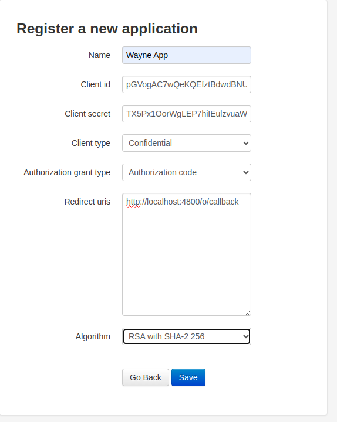

# Python Purchase App

This is a simple Python service designed to manage Customers Purchases. It includes a REST API for inputting and uploading customer and order data, implements authentication and authorization via OpenID Connect, sends SMS alerts to customers when orders are added using Africas Talkin API, includes unit tests.


### Cloning the repository

Clone the repository using the command below :

```bash
git clone https://github.com/WayneMusungu/Purchase.git

```

Move into the directory where we have the project files :
```bash
cd Purchase

```

Create a virtual environment :
```bash
# Create our virtual environment
python -m venv venv

```

--> Activate the virtual environment : <br><br>
windows
```bash
venv\scripts\activate

```
linux
```bash
source venv/bin/activate

```

--> Install the requirements :
```bash
pip install -r requirements.txt

```

--> Migrate Database
```bash
python manage.py migrate

```

--> Create Super User
```bash
python manage.py createsuperuser

```

### Running the App

--> To run the App, we use :
```bash
python manage.py runserver

```

> ⚠ Then, the development server will be started at http://127.0.0.1:8000/


### Creating an Application
--> To create a client application, you need to login. Use the superuser credentials you created to login

```bash
http://127.0.0.1:8000//o/applications/register/ 

```



An auto generated client secret and client will be created. Make sure to copy the those detail and save. 


After saving the created app, you will be redirected to your app detail.


### What is PKCE?
PKCE (Proof Key for Code Exchange) is used in OAuth 2.0 authorization code flow as one of security measures against CSRF attacks.
PKCE involves generating a Code Verifier and a Code Challenge:

### Code Verifier?
A Code Verifier is a random string that needs to be generated. It should be between 43 and 128 characters in length. It's used as the input to derive the Code Challenge.

You can head over to an online python interpreter and generate a Code Verifier

`  

    import random
    import string
    import base64
    import hashlib

    code_verifier = ''.join(random.choice(string.ascii_uppercase + string.digits) for _ in range(random.randint(43, 128)))
    code_verifier = base64.urlsafe_b64encode(code_verifier.encode('utf-8'))
    print(code_verifier)

    code_challenge = hashlib.sha256(code_verifier).digest()
    code_challenge = base64.urlsafe_b64encode(code_challenge).decode('utf-8').replace('=', '')
    print(code_challenge)
`

Copy the printed Code Verifier and Code Challenge

Then you need to start the Authorization using the following url if you are running on local machine

```bash
http://127.0.0.1:8000/o/authorize/register/?response_type=code&code_challenge=CODE_CHALLENGE&code_challenge_method=S256&client_id=CLIENT_ID&redirect_uri=http://localhost:8000/o/callback&scope=openid

```

We pass in the following values in our url

```
•	response_type: code #indicates that the authorization code will be returned.
•	scope: openid #The requested permissions or scopes.
•	code_challenge: CODE-CHALLENGE #A dynamically generated value (PKCE challenge) derived from a secret Code Verifier. This is a crucial component of PKCE for enhanced security.
•	code_challenge_method: S256 #The method of hashing used to encode the Code Verifier
•	client_id: CLIENT_ID #The Client ID obtained during registration.
•	redirect_uri: http://localhost:8000/o/callback #A callback URL where the authorization code will be sent after successful authentication.
```

The authorization request is sent to the Authorization Server, which then authenticates the user.

When the user's authentication is verified, the Authorization Server creates an authorization code and transmits it to the client application at the specified redirect_uri.


When you have received the authorization code head over to postman and initiate a POST request to the token url to get an Access code ```bash
 http://127.0.0.1:8000/o/token/```

Remember to pass in the following parameters
Note the parameters we pass:
```
•	grant_type: Set to "authorization_code" indicating the code exchange flow.
•	client_id: The Client ID.
•	client_secret: The Client Secret.
•	code: The received authorization code.
•	redirect_uri: The same callback URL used in the authorization request.
•	code_verifier: The original secret code verifier used to generate the code_challenge. This is required for PKCE.
```

The process carried out by the Authorization Server involves a series of checks and verifications. Initially, it assesses whether the provided authorization code, client ID, and client secret are valid and in accordance with its records. Additionally, it verifies that the PKCE code verifier aligns with the hashed code challenge, utilizing the specific method designated for this challenge.

Only when all of these validations are completed successfully does the Authorization Server proceed to grant an Access Token, a Refresh Token, and an ID token as part of its response. In essence, these tokens are issued to the client application only after all the required checks and confirmations have been successfully met.


